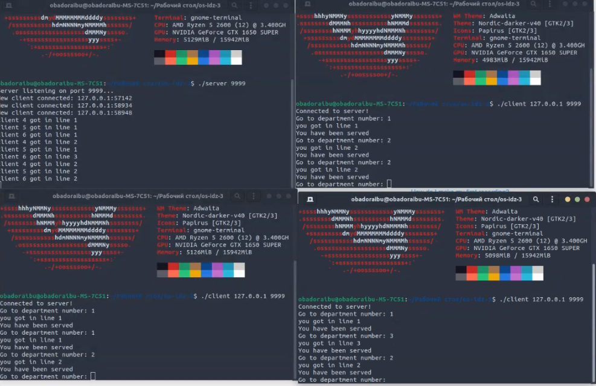

# # os-hw-3
  Завяьлов Егор Сергеевич БПИ-217  Вариант 10

## 
Задача о магазине – 1. В магазине работают три отдела, каждый отдел обслуживает один продавец. Покупатель, зайдя в магазин, делает покупки в одном или нескольких произвольных отделах, обходя их в произвольном порядке. Если в выбранном отделе
продавец не свободен, покупатель становится в очередь и засыпает,
пока продавец не освободится. Создать приложение, моделирующее рабочий день магазина.

---- 
### Запуск:

Для тестирования и запуска программ необходимо,
находясь в нужной директории, ввести в терминал:

> gcc -o server server.c -lpthread;
> gcc -o client client.c;
> ./server <port>

В других окнах-клиентах:
> ./client <ip> <port>
# Модель задачи:
Сервер представляет собой магазин. В магазине работают 3 отдела(seller) реализованные с помощью pthread. Каждый отдел имеет свою очередь queue. Client играет роль покупателя. После установки соединения handle_client() в отдельном потоке слушает сообщения "покупателя" об отделах, которые тот бы хотел посетить. Получая от клиента сообщение 1, 2 или 3, handle_client добавляет client_socket в соответствующую очредь. Продавцы берут сокет из своей очереди, имитируют обслуживание с помощью sleep(5) и отправляют клтенту сообщение об успешном обслуживании, после чего переходят к следующему в очереди покупателю. Очереди реализованы самостоятельно для потокобезопасной работы с использованием pthread_mutex.
  
  
# Демонстрация работы 
  ### 
  [demo MP4](https://github.com/obadoraibu/os-hw-3/blob/main/4-5/IMG_8028.MP4)
